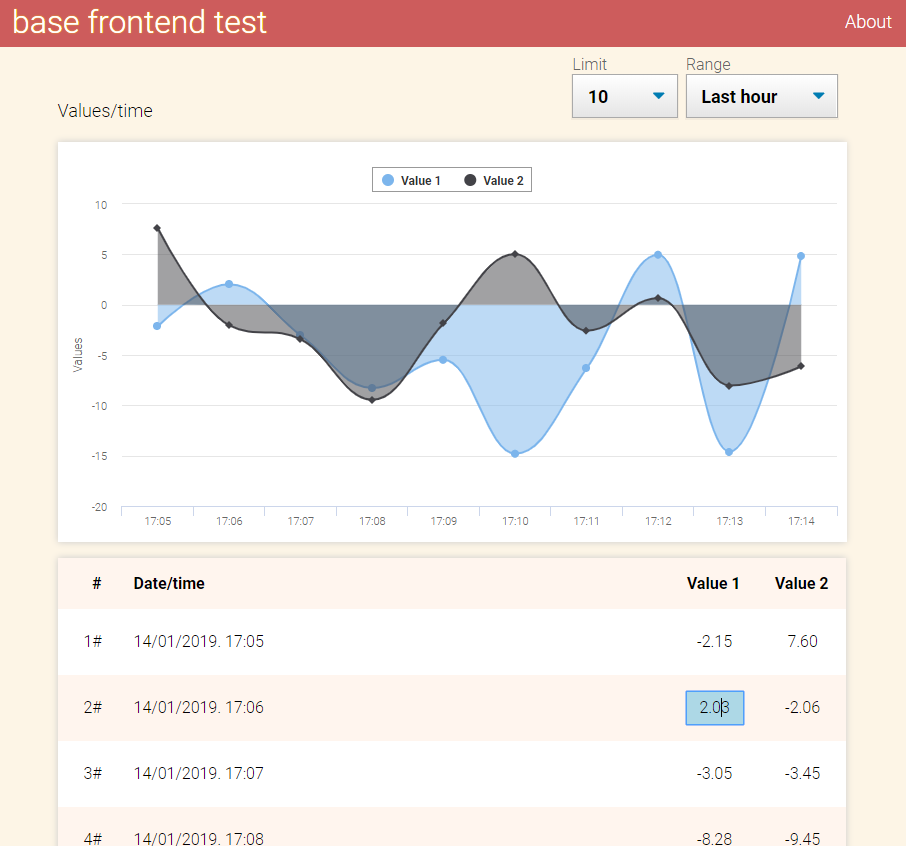

# My solution (vanilla)

This is a *vanilla* version, built with just html, css, native javascript and some external javascript libraries.

The layout interface contains:

* A header with the title and an *About* link. The *About* link shows the content of this README document.

* A Graph rendered with the data received from the backend, using the Highcharts library.

* A table showing the data. The values are formatted with 2 decimals and are editable, as mentioned above.

## How to run the solution

1. Launch backend  server `java -jar backend/server.jar`

2. Launch local web server, for example:

	* if XAMPP is available, start Apache from XAMPP control panel.

	* If PHP is available, open a shell window, go to folder `/solution/vanilla` and launch PHP inner server `php -S localhost:80`.

3. Once web server is active, open a browser and navigate to http://localhost/path_to_folder/solution/vanilla

## How to ensure that future modifications of the code will not break the existing functionality

Well, taking a lot of care usually works...

Just kidding ;),  you have to write unit tests and verify that are passed.

And taking a lot of care.

## A description of the solution

As required in specifications:

> In this test we will ask you to build a simple, but beautiful page that consumes and produces data using a RESTful API.The page you will build displays and allows for the modification of data gathered from an imaginary device. The wireframe of what is expected is in the [specification/wireframe.pdf](./specification/wireframe.pdf) file, essentially it is a table of the data and a graph. The fields `value1` and `value2` of the table should be editable and sent back to the backend.

**Features and functionality**

This version has not focused on replicating exactly the same design but on providing functionality and something else.

* Two inputs to select `limit` (how many elements are requested) and `hours` (range of time).

* Changing the value of  `limit` or `hours` fires a request to then backend.

* When received the backend response, the data is rendered as a html table and converted to series to render the graph.

* Alerts an error if backend is not active.

* Every value rendered in the table is editable when clicking on it. Pressing `TAB`,  `ENTER` or simply unfocus the input, fires a `PUT` request to the backend and render graph and data table. Works fine on Chrome and IE Edge but not in Firefox.

* Responsive.

* Custom CSS and Javascript using no external frameworks or resources, except libraries Highcharts and Moment.js.

## A justification for any framework/library choice

- [Highcharts](https://www.highcharts.com/) for the graph rendering. Any other modern library can do the job but I had some previous experience with this one.

- [Moment.js](https://momentjs.com/) for computing the attributes *start* and *end* when sending request to the backend. I had no previous experience with this library but it's easy to use and saves a lot of time.

## Challenges I faced

To be honest, really not many for this version. I had previous experience doing similar things. This is a demo video of a project I am working in my spare time (better with subtitles on).

<iframe width="560" height="315" src="https://www.youtube.com/embed/zlhKdb0nZCc" frameborder="0" allow="accelerometer; autoplay; encrypted-media; gyroscope; picture-in-picture" allowfullscreen></iframe>
